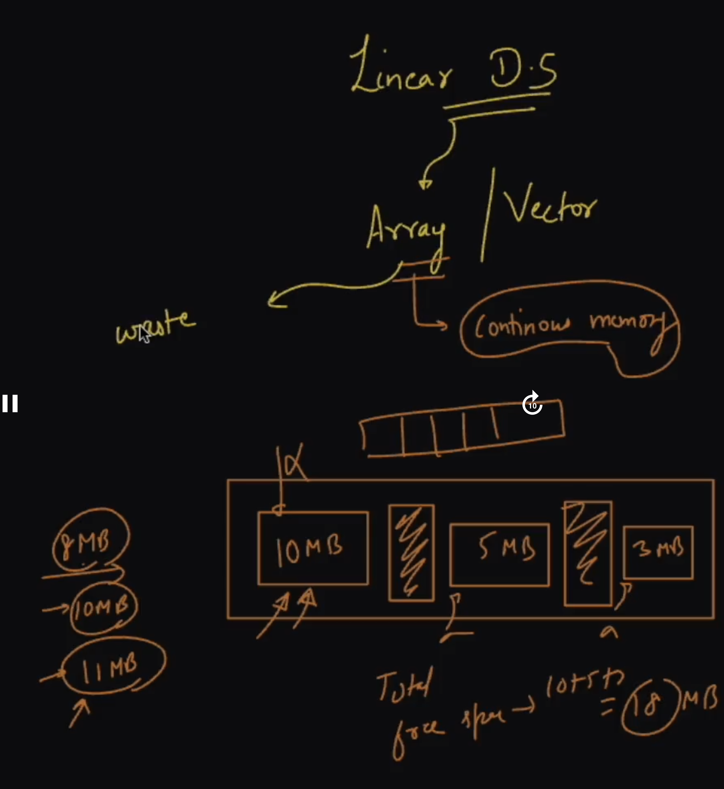

# Linked Lists

- Linear Data Structure
- Non-Continious memory allocation, still memory wastage is there but less than arrays.
- Collection of Nodes
- Node is block of memory with data of datatype and address(pointer to Next Node)

example:

```c++
  class Node {
    int data;
    Node* nextNode; // Pointer to a Node
  }
```

- End Node's address/pointer is stored with Null pointer
- During Runtime we can dynamically grow or shrink memory allocated to linkedlist.
- No Concept of Indexes like arrays in LL so there is concept of Address.
- Corner test cases are more prevalent in LL Problems.
- `Starting Node` of LL is called `Head`
- `Ending Node` of LL is called `Tail`

- `Do not use original pointer to trace linked list always make a copy.`

## Types of Linked List

1. Singly LL
2. Doubly LL
3. Circular LL
4. Circular Doubly LL

## Wastage of space in continious memory based Data structures like arrays and vectors



- If we want to shift elements from one place to other it takes O(n) time complexity.
- To store something in a free space it requires O(1) time complexity.

## Insertion of Node In LL

- Insertion at head node.
- Insertion at Tail node.
- Insertion in between nodes.

## Things to remember while working with LL

- While Tracing a LL like printing LL, `always make a copy of head and iterate on the copy.`
- While Insertion operation always `use the LL's Nodes by reference in function parameters so that you can modify it later.`
- Always spend 5 mins trying to break the LL. Like consider for NULL nodes while insertion, deletion operations.
- Meaning of `empty LL is head is also NULL and tail is also NULL consider both while making changes.`
