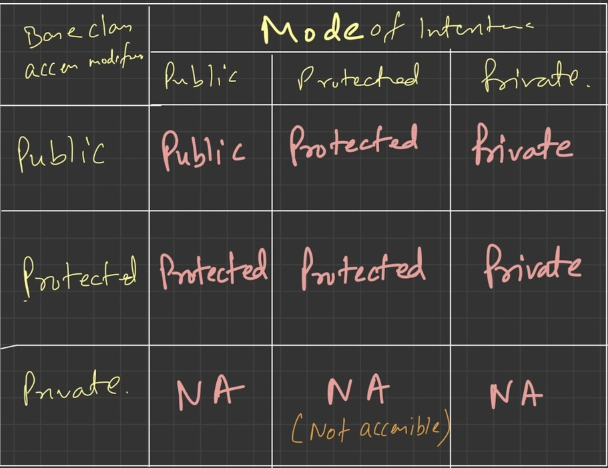
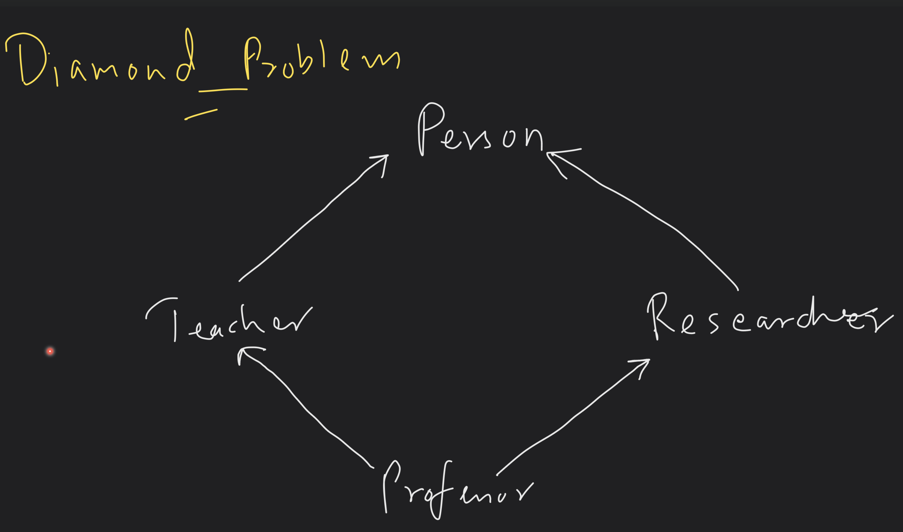
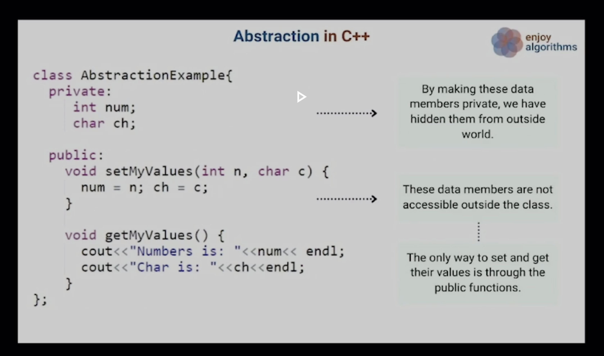

# Oops

## Static Keyword

- `Static Data Member` -> The variable declared is going to share memory with all of class instances
- `Static Member Function` -> There is no instance of that class paved into that method

## Const Keyword

- The const keyword is used to declare that a variable, function, or Object is `immutable`, i.e., its value cannot be changed after initialization
- Ex If you declare a variable as `int x = 5;`, you cannot modify the value of x later in the program. Any attempt to modify the value will result is compilation error.
- We can declare functions also as const, which means that it does not modify the state of the object it is called on.
- Compiler may be able to store const variable in read-only memory, which can result in faster access time.

## L-Value and R-Value Variables

### L-Value Variable

Variables for which memory allocation is done, or having a memory location.
`Ex -> int x; char y;`

### R-Value Variable

Variables which does not have a memory location
`Ex -> 5; int &a = b;`

## Macros

- In C++, macros are the preprocessor directives that allow you to define constants, functions or code snippets that can be used throught your code.
- They are typically defined using the #define directive and are evaluated by the preprocessor before the code is compiled.
- Macros can be used for a variety of purposes, such as defining constants or creating shorthand for commonly used expressions

## Behaviour of space in classes

### Empty Classes

```c++
class EmptyC {
  // This is an empty class to demonstrate space occupied by classes
};
```

Empty classes occupy only 1 byte of space

### Classes with variables and functions declared in it

```c++
class Student {
  int id;
  int age;
  bool isPresent;

  void study() { cout << "Studying" << endl; };
  void bunk() { cout << "Bunking" << endl; };
  void sleep() { cout << "Sleeping" << endl; };
  void writeAssignment() { cout << "Writing Assignments" << endl; };
};

int main() {
  cout << sizeof(Student) << endl;
}
```

Here the size of ints is considered and the answer would be surprisingly 12bytes

- Functions are allotted space only when they are called.
- Ints are of 4 bytes -> `8 bytes for 2 ints`.
- Bool is of 1 byte -> `1 byte for one bool variable`.
- The final answer should have been `9 bytes`.
- But `the answer would be 12 bytes`.
- Because ->
- Considering Computer Architecture and CPU, CPU occupies 4 to 8 bytes in memory bus minimum,
depending upon the Architecture, it will be easy to do operations on fixed size than random size of 1 byte or 2 byte `CPU will add padding size` for the `remaing space in 4 or 8 byte` to process operations fast and obviously `memory is wasted` `but the speed of execution is increased`.
- This happens in newer computers and compilers and old computers will return `9 bytes`.
- Compiler might pick the `chunks in most repeated biggest data type` provided in the code block.
- Or you can say align sum of datatypes in the boundary of biggest datatype in codeblock.
- Try

```c++
class Student {
  double id;
  double age;
  bool isPresent;

  void study() { cout << "Studying" << endl; };
  void bunk() { cout << "Bunking" << endl; };
  void sleep() { cout << "Sleeping" << endl; };
  void writeAssignment() { cout << "Writing Assignments" << endl; };
};

int main() {
  cout << sizeof(Student) << endl;
}
```

`The answer will be 8 + 8 + 8 (instead of bool's 1byte) = 24bytes`

- `Important` -> The compiler will bring down the size for lesser size datatype variable to the nearest multiple of biggest datatype.

For example

```c++
class Student {
  double id;
  double age;
  char initials;
  bool isPresent;

  void study() { cout << "Studying" << endl; };
  void bunk() { cout << "Bunking" << endl; };
  void sleep() { cout << "Sleeping" << endl; };
  void writeAssignment() { cout << "Writing Assignments" << endl; };
};

int main() {
  cout << sizeof(Student) << endl;
}
```

The answer will be 24 bytes -> 2 double vars will occupy 8 bytes and now we have char and bool of 1 byte each left, the compiler will allocate 4 bytes each or you can say 4*4=8 (or double's size).

## Why we need copy ctor

To Deep copy a class.

## Lifecycle of variable

- init
- copy
- destroy

## Lifecycle of an object / instance of class

both ctor and detor if not provided in class compiler adds by default

- ctor - constructor
- dtor - destructor
- copy ctor

Also these 3 do not have return type

## Pillars of OOPs

- Abstraction

Definition: Hiding complex implementation details and showing only the necessary features of an object.

Purpose: To simplify complex systems by breaking them into more manageable parts.

Benefits: Reduces complexity, allows focusing on relevant aspects without worrying about implementation details.

- Inheritence

Definition: The mechanism by which a class can inherit properties and methods from another class.

Purpose: To create a hierarchy of classes, promoting code reuse and establishing relationships between classes.

Benefits: Encourages code reusability, supports hierarchical classification, and enables polymorphism.

- Encapsulation

Definition: Bundling data and methods that operate on that data within a single unit (class).

Purpose: To hide the internal state and functionality of an object and only allow access through a public
interface.

Benefits: Improves modularity, reduces complexity, and protects data integrity.

- Polymorphism

Definition: The ability of objects of different classes to respond to the same method call, potentially in different ways.

Purpose: To allow objects to be treated as instances of their parent class rather than their actual class.
Types:
a) Compile-time polymorphism (method overloading)

- function overloading
- operator overloading

b) Runtime polymorphism (method overriding)

Benefits: Increases flexibility in design, simplifies code, and allows for more dynamic behavior.

## Mode of Inheritance Table



example

Methods and variables declared as public in base class,

- if in child class the mode of inheritence is public then the methods and variables are inheritated as public.
- if in child class the mode of inheritence is Private then the methods and variables are inheritated as Private.
- if in child class the mode of inheritence is Protected then the methods and variables are inheritated as Protected.

and so on for other cases.

More on public, private, protected

- Public Members declared in base class are accessible within base class and accessible with its derived class, and are also modifiable in base class and derived class.
- Private Members declared in base class are accessible within base class and not accessible in its derived class, and are also modifiable in base class and not modifiable in derived class.
- Protected Members declared in base class are accessible within base class and are accessible in its derived class.

### Types of Inheritence

- Single Inheritence
  A class inherits from only one parent class.

  ```c++
  class Animal {};
  class Dog: public Animal {};
  ```

- Multiple Inheritance:

A class inherits from more than one parent class.

 ```c++
  class A {};
  class B {};
  class C : public A, public B {};
 ```

- Multilevel Inheritance:

A class inherits from a child class, forming a chain.

```c++
class Animal {};
class Mammal: public Animal {};
class Dog: public Mammal {};
```

- Hierarchical Inheritance:

Multiple classes inherit from a single base class.

```c++
class Animal {}
class Dog : public Animal {}
class Cat : private Animal {}
```

- Diamond Problem Scenarios / Virtual Inheritence.



Example:

- Person is a base class
- Teacher is also a person
- Researcher is also a person
- Teacher and Researcher can be Professors too.
- Should I assign Professor as Person explicitly ? No
- Why ? Since Teacher and Researcher are already inheriting Person, so virtually Person already exists
- Also called as virtual inheritence.
- Used to prevent multiple instances of a base class in diamond problem scenarios.
- This is specific to C++.

## Friend keyword

- Friend is keyword in C++ that is used to share the information of a class that was previously hidden.
- For example, the private members of a class are hidden from every other class and cannot be modified except through getters or setters member functions. Similarly, the protected members are hidden from all classes other than its children classes.

### usage of friend keyword

- Although information hiding is encouraged because it prevents unwanted bugs in a program there are cases where two classes need to frequently interact with each other.
- In such a scenario, one of the classes declares another to be its friend.
- The class declaring the friendship can now make all of its data available to its friend.

## Virtual Keyword

when mentioned with class, function, or variable the decesion to use the version of that specific class, function, or variable will be made runtime.

- Way to acheive Runtime Polymorphism

### working of virtual

- Vtables or virtual tables
- Formed for every class having at least one virtual function and for its derived class.
- It is static arrays, hence then one instance for a class.
- VPTR ( a hidden member pointer ) is added by compiler to classes with virtual and its derived classes.
- Depending upon the object type VPTR is bonded to a VTable.
- VTables are created at compile time.
- When object of a particular type is created at runtime. There will be a vPTR which is initialised to point to a static vTable at the time of construction.

### Can we make virtual ctor

- No.
- Because when constructor of a class is executed there is no virtual table in memory, means no virtual pointer defined yet. so the constructor should always be non virtual.
- A virtual call is a mechanism to get work done given partial information. In particular, "virtual" allows us to call a function knowing only any interfaces and not the exact type of the object.
To create an object you need complete information. In particular, you need to know the exact type of what you want to create. Consequently, a "call to a constructor" cannot be virtual.

### Can we make virtual detor

- Yes.
- It is really `important` to handle proper destruction of Derived classes.

## Abstraction in C++

1. Delivering only essential information to the outer world while masking the background details.
2. It is a design and programming method that separates the interface from the implementation.
3. Real life e.g., various functionalities of AirPods but don't know the actual implementation/ working. To drive a car, one only needs to know the driving process and not the mechanics of the car engine

- Abstraction and loose coupling

### Abstreaction In Header files

1. Function's implementation is hidden in header files.
2. We could use the same program without knowing its inside working.
3. E.g., Sorto, for example, is used to sort an array, a list, or a collection of items, and we know that if we give a container to sort, it will sort it, but we don't know which sorting algorithm it uses to sort that container.

### Abstraction using class



1. Grouping data members and member functions into classes using access specifiers like public, private, protected.
2. A class can choose which data members are visible to the outside world which are hidden.

### What is abstract class

- Class that contains at least one pure virtual function and these classes cannot be instantiated.
- It has come from the idea of Abstraction.
- Example for pure virtual function and abstract class shown in [Link to pure virtual function](./abstractClass//Bird.h)
- Abstract class becomes an interface or blueprint for child classes.

### Design Stratergy

1. Abstraction divides code into two categories: interface and implementation. So, when creating your component, keep the interface separate from the implementation so that if the underlying implementation changes, the interface stays the same.
2. In this instance, any program that uses these interfaces would remain unaffected and would require recompilation with the most recent implementation.

## Inline Functions

- An Inline function is a regular function that is defined by the inline keyword.
- THe code for an inline function is directly inserted into the code of the calling function by compiler while compiling, which can result in faster execution and less overhead compare to regular function call.
- Instead of calling function the statement of the function are pasted in calling function.
- Used with small sized functions. so that executables are small ( handled automatically by compiler optimization levels).
- Inline functions consume a lot of space. To check space utilisation run command after compilation of [inlineFunctions.cpp](./inlineFunctions.cpp).

```terminal
  ls -al a.out
```
